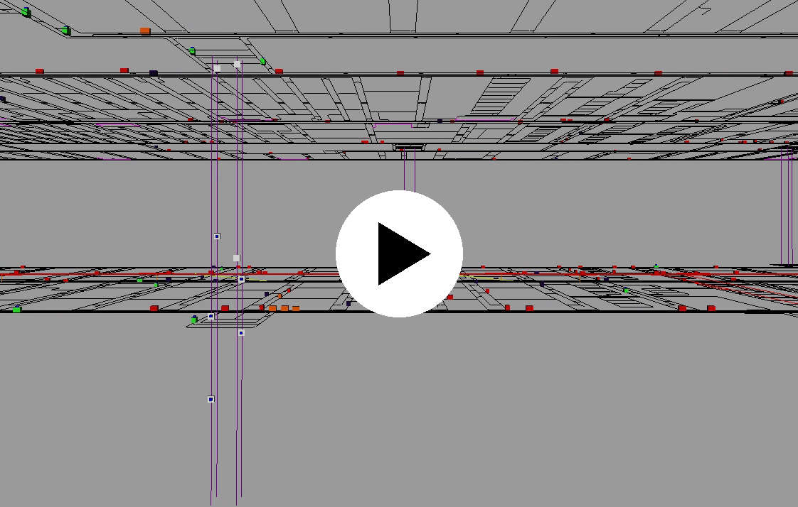

# AutoMod Mega Factory

AutoMod 기반 대규모 Mega Factory / 물류 시뮬레이션 데모 저장소입니다.

## Demo Video

아래 이미지를 클릭하면 Mega Factory 시뮬레이션 데모 영상을 다운로드 받을 수 있습니다.

[](https://raw.githubusercontent.com/Mega-Sim/AutoMod_Mega_Factory/main/assets/Mega_factory.mp4)

> 썸네일을 클릭하면 GitHub 파일 보기 페이지가 아니라 raw MP4 주소로 이동합니다. 브라우저가 MP4 재생을 지원하면 새 화면에서 바로 재생됩니다.

## Overview

이 프로젝트는 반도체/제조 물류 환경에서 OHT 기반 자동반송 시스템의 흐름을 시뮬레이션하고, 대규모 설비 배치에서 물류 처리량과 병목 구간을 검토하기 위한 목적의 데모입니다.

주요 관심 항목은 다음과 같습니다.

- 대규모 Factory Layout 기반 OHT 주행 시뮬레이션
- OHT Job / Delivery 흐름 검토
- Rail / Station / Bay 구조 기반 물류 흐름 분석
- 병목 구간 및 처리량 검토를 위한 시각화

## Repository Structure

```text
.
├── README.md
└── assets/
    ├── Mega_factory.mp4
    └── mega_factory_thumbnail.png
```

## Notes

현재 저장소는 데모 영상과 프로젝트 소개를 중심으로 구성되어 있습니다. 이후 시뮬레이션 모델, 레이아웃 변환 도구, 분석 스크립트 등을 단계적으로 추가할 수 있습니다.
